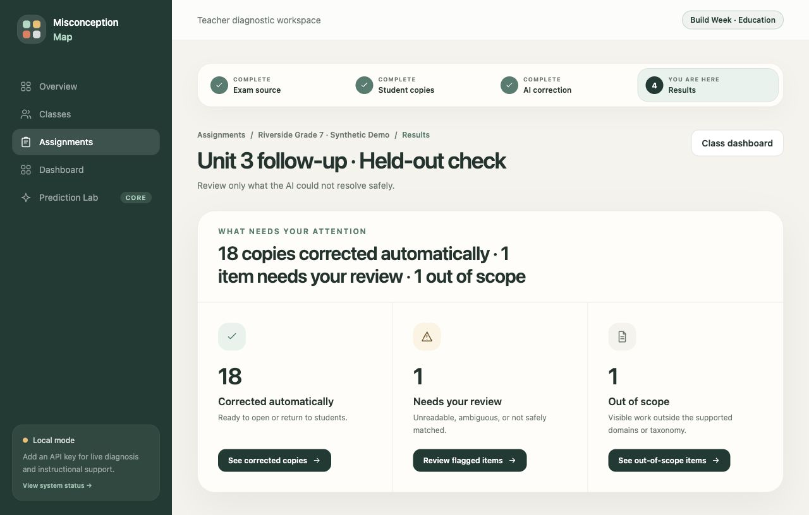
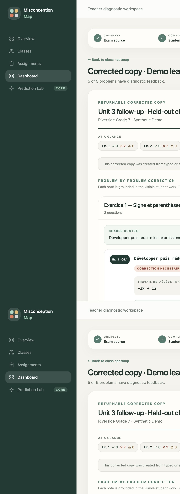

# Misconception Map

Misconception Map is a local, teacher-facing diagnostic workspace for middle-school algebra and fractions. It turns a structured exam and deidentified student work into four answers a teacher can read quickly:

1. Where am I?
2. What needs my review?
3. How is the class doing, exercise by exercise?
4. What happened on this copy?

There are no grades or points. The product corrects what it can support from visible work, abstains when evidence is weak, and treats every Student Model as a versioned, testable hypothesis rather than a fixed learner attribute.

## What the demo proves

- A visible four-step assignment path: **Exam source → Student copies → AI correction → Results**.
- Hierarchical extraction that preserves every printed exercise, shared stimulus, and question label. The real six-page French brevet fixture returns all six exercises; unsupported geometry, probability, and statistics questions remain visible as out of scope instead of disappearing.
- A results triage that asks the teacher to review only ambiguous, unreadable, unmatched, or out-of-scope work.
- A class summary by exercise before the full misconception heatmap.
- Corrected copies grouped by exercise, with shared context shown once and feedback written in the language of the exam.
- Targeted five-question micro-practice, a teacher answer key, and a short “Teach This Tomorrow” intervention.
- A Prediction Lab that locks flawed-rule, demonstrated-mastery, or abstain predictions before held-out work exists, then scores, revises, or invalidates them transparently.

Misconception Map is built for the Education category of OpenAI Build Week. Next.js and SQLite run on the teacher’s machine. Only live extraction, diagnosis, model synthesis, practice, briefs, and predictions call the OpenAI API.

## Quickstart

Prerequisites: Node.js 20.9 or newer (Node.js 24 recommended) and npm.

~~~bash
git clone <your-repository-url>
cd "Misconception Map"
npm install
cp .env.example .env.local
npm run seed
npm run dev
~~~

Open [http://localhost:3000](http://localhost:3000).

For live AI features, put one key in `.env.local` before starting the app:

~~~dotenv
OPENAI_API_KEY=your_key_here
~~~

`npm run dev` applies checksummed SQLite migrations before starting Next.js. The app binds to `127.0.0.1`; do not expose this single-teacher build through a LAN binding or public reverse proxy.

### No API key? Use the judge path

Leave `OPENAI_API_KEY` empty, run `npm run seed`, and open the app. The deterministic synthetic classroom works fully without network access or API spend. It includes exactly:

- 20 synthetic learners and two completed assignments;
- the four-step assignment path, reopening at Results;
- a triage with **18 copies corrected automatically, 1 item needing review, and 1 out of scope**;
- a three-exercise dashboard with success rates, dominant misconceptions, and flagged counts;
- exercise-grouped corrected copies with French prompts and French step feedback;
- a printable targeted worksheet and teacher answer key linked to `Ex. 2 · Q2.2`;
- a Teach This Tomorrow brief;
- a 4-of-5 consistency-weighted Student Model, a locked mastery prediction, a teacher-reviewed revision suggestion, abstentions, matches, mismatches, and invalidation history.

Live-only controls remain visibly disabled and explain that `OPENAI_API_KEY` must be added to `.env.local`. There are no dead clicks; seeded views remain readable.

## Five-minute product tour

1. Open **Assignments**, then **Unit 3 follow-up · Held-out check**. The assignment resumes at step 4.
2. Read the triage sentence, open **Review flagged items**, inspect the transcription, page preview, and reasons, add an optional note, then mark it reviewed. Left/right arrows navigate; `Esc` returns to triage.
3. Open **Class dashboard**. The three exercise rows identify the difficult exercise before the heatmap. Open a heatmap cell to inspect exact evidence; `Esc` closes the drawer and returns focus to the cell.
4. Open a learner’s **Corrected exam**. Use the summary chips to jump to an exercise. Print to PDF to see the A4 layout without application chrome.
5. Open **Prediction Lab**. Inspect predictions that were timestamped and locked before the held-out responses, including visible abstentions and invalidated historical trials.

## Run one live correction

All live calls use `gpt-5.6`, strict Structured Outputs, `store: false`, prompt/schema versions, input/output hashes, token counts, and latency provenance.

### Synthetic image fixture

1. Configure the key, seed the demo, and start the app.
2. Open **Diagnose work** and choose the synthetic class.
3. Create an Algebra assignment. Paste a short teacher source such as:

   ~~~text
   Exercice 1 — Signe et parenthèses
   1.1 Développer puis réduire −3(x + 4). Réponse : −3x − 12.
   ~~~

4. Confirm the extracted `Ex. 1 · Q1.1` question.
5. Upload `sample-work/01-negative-distribution.jpeg` for a demo learner, attest that it contains no identifying information, check the match, and run correction.
6. The permanent regression fixture `fixtures/student-work/sign-error-equals-regression.jpeg` is also available. It protects the case where a faint handwritten `=` was once read as a dash.

All files in `sample-work/` and `fixtures/student-work/` are synthetic and name-free.

### Real six-page French exam and booklet

The real evaluation files are intentionally not committed because they are not synthetic project assets. If you have the local fixtures, use:

- teacher source: `2019_07_Amerique_du_Sud_Serie_generale_SUJET.pdf`;
- deidentified booklet: `2019_07_Amerique_du_Sud_Cecilia.pdf`.

Create an Algebra assignment, upload the teacher PDF, and review extraction before confirming. The review must show **Exercices 1–6** with their original numbering. Exercises outside algebra/fractions are preserved and marked out of scope; they are never silently dropped or forced into an algebra misconception. Then upload the booklet as one full-page PDF. Matching uses printed cues such as `1.1` and `Ex 7 Q3`; ambiguous work is sent to teacher review rather than guessed into a slot.

The verified fixture produced French feedback and a 12-page A4 corrected report with the summary on page 1, exercise boundaries, and no orphaned question headers.

## Teacher workflow and evidence model

### 1. Exam source

Teacher intake accepts typed text, JPEG, PNG, WebP, and PDF up to 15 MB. Printed sources use low-detail vision and low reasoning effort. The extraction schema is a strict root object containing exercises, optional shared context represented explicitly as `null`, original or synthesized question labels, self-contained statements, expected answers, answer kinds, domains, confidence, and review notes.

An identical extraction input hash reuses the stored run. The teacher edits labels, statements, context, domains, and answers before confirmation. Confirmed grouping is immutable; legacy assignments are migrated into a default exercise without renumbering already-diagnosed work.

### 2. Student copies

Student intake accepts the same formats up to 10 MB per file, 20 files and 80 MB per queue, or 20 typed responses of up to 8,000 characters. Work is saved locally before diagnosis. Roster names and original filenames are excluded from OpenAI payloads and hashes.

Single-question images are auto-oriented, line-aware cropped, contrast-normalized, and retained with a metadata-stripped full-frame fallback. Full pages and PDFs are not cropped. Handwritten diagnosis keeps high-detail vision and medium reasoning effort. The prompt explicitly warns that `=` can resemble a short dash, and an implausible variable-bearing final fragment caps confidence instead of allowing a guessed diagnosis.

### 3. AI correction

The model segments visible work against confirmed exercise and question labels, transcribes exact steps, and returns one strict diagnosis object per match. A deterministic policy then enforces evidence grounding, domain compatibility, transcription quality, and the `0.72` confidence threshold.

A wrong answer alone never becomes a misconception. A definitive label requires a grounded incorrect step, exact evidence quote, observed transformation, and enough confidence. OpenAI failures persist a sanitized retry state. Repeating the same submission replays the saved diagnosis before the API-key check, so refreshes and retries do not create duplicate spend.

### 4. Results

The triage divides results into automatically corrected, needs review, and out of scope. A teacher note is persisted on reviewed items. The dashboard uses identical legend semantics everywhere:

- green: demonstrated correct reasoning;
- amber/coral: emerging/strong misconception evidence;
- gray: not assessed.

All surfaces use the same `Ex. 1 · Q1.2` reference formatter: queue, triage, heatmap drawers, practice sheets, Prediction Lab, corrected copies, and print.

## Student Model and Prediction Lab

A Student Model is a versioned, falsifiable learner hypothesis tied to exact work. One response can create only a provisional version. Support requires evidence from at least two distinct problem fingerprints without contradiction. Each new version separately records how often the flawed rule appeared when it could have applied and which related skills were demonstrated correctly; legacy versions keep those nullable fields as “consistency unknown.”

Prediction Lab applies one supported model version to unseen content without sending the student name. Each prediction is locked and timestamped before held-out work exists as one of three kinds: `FLAWED_RULE_APPLIES`, `MASTERY`, or `ABSTAIN`. Flawed-rule confidence snapshots the observed application rate; mastery requires matching demonstrated-correct skill evidence and predicts the expected correct answer. Later work appends the same deterministic match/mismatch outcome for every answer prediction. A miss creates a strict, null-based revision suggestion; only a teacher confirmation creates a provisional v+1. Updating a model invalidates its older locks without deleting history or silently moving trials to the new version.

Expected-versus-actual reporting treats a 3-of-4 result as consistent with a 0.8-application model rather than implying deterministic failure. This follows the within-student strategy variability documented by Siegler & Pyke (2013). The Prediction Lab is deliberately not weakened for demo convenience: abstentions remain visible, invalid trials remain visible, and syntactically nonidentical equivalent forms are not silently counted as matches.

## Status, costs, and verification

Open `/status` to see database migration state, taxonomy synchronization, whether live AI is configured, and the most recent saved runs with input, output, and total tokens, latency, and cache-hit status.

Useful commands:

| Command | Purpose |
| --- | --- |
| `npm run dev` | Migrate and start development mode on loopback. |
| `npm run seed` | Idempotently load the 20-learner synthetic classroom. |
| `npm run db:migrate` | Apply checksummed SQL migrations. |
| `npm run db:check` | Verify SQLite integrity and bootstrap records. |
| `npm run sample-work` | Regenerate the eight synthetic JPEG fixtures with Sharp. |
| `npm run verify:phase1` | Domain model, evidence, versioning, prediction, and invalidation invariants. |
| `npm run verify:hierarchy` | Hierarchical extraction, legacy migration, label matching, and grouped demo shape. |
| `npm run verify:phase2` | Diagnosis schema, grounding, confidence, domain, and abstention policy. |
| `npm run verify:images` | Faint-ink, crop, and handwritten-equals regression fixtures. |
| `npm run verify:pdf` | PDF signatures, generated API filenames, and local persistence. |
| `npm run verify:diagnosis-contracts` | Compile-time-safe single/full-page persistence contracts. |
| `npm run verify:phase4` | 4-of-5 consistency, expected/actual fit, all three prediction kinds, revision suggestions, practice, and briefs. |
| `npm run verify:readiness` | Fresh/seeded DBs, no-key states, language, print, accessibility, cost, cache, and status ledger. |
| `npm run check` | Lint, typecheck, every verifier, and production build. |

For an isolated database, prefix commands in the shell. Migration scripts intentionally do not read this override from `.env.local`:

~~~bash
MISCONCEPTION_MAP_DB_PATH=/tmp/misconception-map-smoke.db npm run seed
MISCONCEPTION_MAP_DB_PATH=/tmp/misconception-map-smoke.db npm run dev
~~~

### Clean-install proof

Verified on July 16, 2026 from commit `5a9b614` with Node `v24.5.0` and npm `11.13.0`. The proof used a new local clone with no copied database or `node_modules`:

~~~bash
git clone --no-local "/path/to/Misconception Map" /tmp/misconception-map-clean-install
cd /tmp/misconception-map-clean-install
npm install
cp .env.example .env.local
OPENAI_API_KEY= npm run seed
OPENAI_API_KEY= npm run check
OPENAI_API_KEY= npm run dev -- --port 3200
~~~

The no-key browser smoke covered Overview, Assignments, the 18/1/1 triage, exercise dashboard, grouped corrected copy, Prediction Lab (4 of 5 observed applications, 3 actual versus 3.2 expected flawed-rule hits, one mastery prediction, and one revision suggestion), diagnostic setup, and `/status`. Live-only controls were disabled with the `.env.local` explanation.

For the live smoke, the local key was added to the clone’s ignored `.env.local`, the server was restarted, and `sample-work/01-negative-distribution.jpeg` was uploaded for a new synthetic learner against `Ex. 1 · Q1.1`. GPT-5.6 returned a grounded French `NEEDS_REVIEW` result instead of forcing a taxonomy match. The run saved 6,151 input and 1,393 output tokens; `/status` displayed 7,544 total. Repeating the identical diagnosis returned the persisted result while the database remained at exactly one diagnosis run.

## Architecture

- Next.js App Router, React Server Components, TypeScript, and Tailwind CSS.
- Local SQLite through `better-sqlite3`, with checksummed migrations and integrity triggers.
- Small client islands for intake, review, heatmap drawers, Prediction Lab, and print actions.
- Node.js route handlers for local file processing and OpenAI Responses API calls.
- `gpt-5.6` is the only live model.
- Strict structured output on worksheet extraction, page segmentation, diagnosis, Student Model synthesis, practice, teaching briefs, three-kind predictions, and outcome-driven model-revision suggestions.
- Append-oriented answer versions, diagnoses, Student Models, prediction locks/outcomes, teacher reviews, and AI provenance.

The data graph covers classes, memberships, exercises, reusable problems, assignment items, protected assets, upload batches, submissions, answer versions, diagnosis steps/candidates, teacher review notes, Student Model evidence/opportunities/mastery, append-only revision decisions, worksheets, teaching briefs, frozen predictions, token provenance, and redacted audit events. Composite foreign keys and triggers keep every record inside its class and assignment.

## Accessibility and print

- Visible `:focus-visible` treatment across links, controls, fields, and disclosure widgets.
- Native buttons for heatmap cells with descriptive student, question, state, severity, frequency, and evidence labels.
- Keyboard triage with previous/next arrows and `Esc` back to summary.
- Evidence drawers close with `Esc` and return focus to their source cell.
- Icons and explicit text accompany every color state.
- Corrected copies and practice/answer keys print to A4 without the sidebar or application header.
- The corrected-copy summary remains on page 1; exercises start on clean page boundaries; long questions break only between readable feedback blocks.

## Troubleshooting

**Live button is disabled.** Add `OPENAI_API_KEY` to `.env.local`, stop the running server, and restart `npm run dev`. `/status` must say `gpt-5.6 is configured`.

**Fresh clone shows no classes.** Run `npm run seed`. The empty state intentionally gives that as its only next action.

**A PDF is rejected.** Confirm it has a valid `%PDF-` signature and is below 15 MB for a teacher source or 10 MB for student work. Password-protected or malformed PDFs are not supported.

**An exercise appears out of scope.** Extraction preserves the printed block, but only algebra and fractions can receive taxonomy diagnoses. Edit a wrongly inferred domain during review; do not relabel geometry/probability merely to force a diagnosis.

**OpenAI failed mid-flow.** The local source or submission remains saved with a sanitized error. Use the single retry action. Do not re-upload: identical stored work is reused.

**Port 3000 is busy.** Stop the other local Next.js process or run `npm run dev -- --port 3001` and open the displayed loopback URL.

**Native SQLite module fails after changing Node versions.** Remove `node_modules`, run `npm install` again with Node 20.9+, then run `npm run check`.

## Privacy

All committed and seeded student work is synthetic and name-free. Raw roster names remain in local SQLite and are never sent to OpenAI. Before any upload, the teacher must attest that visible names and identifying PDF properties were removed. Typed sources are also blocked when they contain an exact local roster name or a textual roster-name component of two or more characters; purely numeric roster suffixes do not block ordinary math answers. This is a narrow guard, not general personal-data detection.

Images have metadata removed. PDF API filenames are generated. Protected uploads live outside `public/` and are served only through loopback-guarded, database-owned routes with private, no-store caching. The app does not encrypt or automatically purge local files. Anything still visible inside an attested image or PDF is sent to OpenAI, so this hackathon build is not a substitute for institutional consent, retention, security, or child-safety review.

OpenAI calls use `store: false`. The teacher source, assignment context, and deidentified work needed for the task are sent; local roster labels and original filenames are not.

## Roadmap

- Native in-app PDF page rendering and page-aware feedback markers.
- Hierarchical cross-page matching v2, including page-numbered regions for multi-page booklets.
- A student mode for receiving corrected copies and completing discrepant-event practice.

## Draft — How Codex and GPT-5.6 were used

> **TODO (author):** Personalize this draft with your own motivation, the decisions you made during the build, and what surprised you. Add the Codex `/feedback` Session ID before submission: **`TODO: SESSION_ID`**.

The author set the product boundaries: local-first teacher workflow, algebra/fractions scope, no grades, strict abstention, versioned Student Models, Prediction Lab as the signature feature, and a deterministic judge path. Codex was delegated implementation, repository inspection, schema/migration work, adversarial verification, regression diagnosis, UI iteration, real-fixture testing, and print/accessibility QA. The author retained product calls such as sequencing triage before hierarchy, preserving unsupported exam content rather than forcing labels, and never weakening prediction history for the demo.

One live handwriting test exposed a consequential OCR error: a faint handwritten `=` was read as a dash. That failure became engineering work rather than prompt folklore. The history records the image pipeline/fallback fix in `7b061d0`, and the repository now keeps an exact permanent fixture at `fixtures/student-work/sign-error-equals-regression.jpeg`. The input pipeline auto-orients and crops single-question work around line-aware ink, retains a full-frame fallback, and the diagnosis policy flags an implausible variable-bearing final fragment instead of accepting a confident guess. `npm run verify:images` keeps that regression reproducible.

Codex also diagnosed a full-page persistence contract failure: spreading the complete GPT service result into a narrower repository shape allowed fields to drift across a strict schema boundary. The fix in `cfde617` introduced explicit completion-field selectors, compile-time `satisfies` checks against the repository inputs, and a permanent verifier for both single-question and full-page results. Later optional region work (`97864fe`) extended the contract without weakening backward compatibility.

The verification suite was built adversarially around failure modes, not only happy paths: faint ink, handwritten equals signs, implausible steps, PDF signatures, oversized or unsafe intake, stale runs, evidence grounding, cross-domain labels, confidence thresholds, strict persistence, legacy flat migrations, all-six-exercise extraction, ambiguous label matching, no-key routes, cache reuse, A4 page fragmentation, and Prediction Lab invalidation. `npm run check` runs every `verify:*` script plus lint, typecheck, and a production build.

GPT-5.6 powers every live model call and no other model is used. Every call has a strict root-object Structured Output: teacher-source vision extraction; full-page exercise/question segmentation; single and booklet diagnosis; Student Model synthesis and revision suggestions; five-question discrepant-event practice; Teach This Tomorrow briefs; and three-kind held-out predictions. Printed teacher sources use low image detail and low reasoning effort; handwritten diagnosis uses high detail and medium effort. Identical extraction hashes and persisted submission diagnoses are reused before another call is considered, while `/status` makes per-run token counts and cache hits visible.

> **TODO (author):** Add one short paragraph in your own voice distinguishing the moments where you rejected or redirected Codex’s proposal, and include the final `/feedback` Session ID.

## License

MIT
